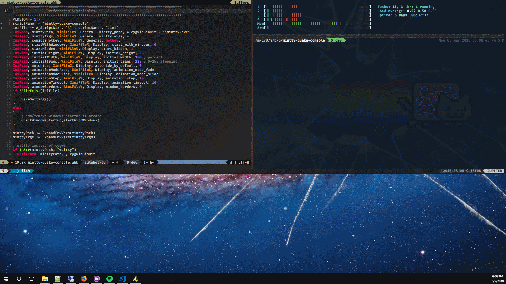

# mintty-quake-console

An [AutoHotkey](http://www.autohotkey.com/) script that enables a quake-style terminal-on-a-hotkey for [mintty](https://github.com/mintty/) (like [Visor](http://visor.binaryage.com/) for OS X or [Tilda](https://github.com/lanoxx/tilda)/[Guake](http://guake.org/) on Linux)



## Requirements

- [mintty](https://github.com/mintty/) (installed through [Cygwin](http://www.cygwin.com), [MSYS](http://www.mingw.org/wiki/MSYS) or [wsltty](https://github.com/mintty/wsltty))

## Usage

[Download the latest release](https://github.com/lonepie/mintty-quake-console/releases) and run `mintty-quake-console.exe` (or, if you have AutoHotkey installed, run the `mintty-quake-console.ahk` file directly).

right click mintty-quake-console icon in system tray -> "Options"

press `Ctrl + ~` (or configured keybinding) to toggle console

note: after editing the ini file, reload the script by right-clicking the tray icon and selecting **Reload**

## Ini/Option Reference

**mintty_path** = path to mintty.exe

**mintty_args** = arguments to pass to mintty.exe

**hotkey** = key combination to show/hide console ([AutoHotkey format](https://www.autohotkey.com/docs/Hotkeys.htm) & [Keylist](https://www.autohotkey.com/docs/KeyList.htm))

**start_with_windows** = add this script to Windows startup (1) or disable (0)

**start_hidden** = show mintty.exe when script is started (0) or wait for hotkey (1)

**initial_height** = height (in pixels) of the mintty console

**initial_width** = width (percentage of screen width) of the mintty console

**initial_trans** = transparency (range from 0 to 255) of the mintty console

**autohide_by_default** = set to 1 to automatically hide mintty when it loses focus

**animation_step** = number of pixels to shift each step of the slide animation

**animation_timeout** = how long (in ms) to wait between each animation_step

**animation_mode_slide** = set to 1 to use sliding animation (up/down)

**animation_mode_fade** = set to 1 to use fading animation (in/out)

## Tips

Use **Ctrl+Alt+Numpad(+/-)** to increase or decrease the console height

### Use with [wsltty](https://github.com/mintty/wsltty)

Essentially, copy the settings from the shortcut(s) created by wsltty:

```ini
mintty_path=%LOCALAPPDATA%\wsltty\bin\mintty.exe
mintty_args=--WSL= --configdir="%APPDATA%\wsltty" -~
```

#### wsltty non-default shell

Append shell path to `mintty_args`:

```ini
mintty_args=--WSL= --configdir="%APPDATA%\wsltty" -~ /usr/bin/fish -li
```

#### Cygwin non-default shell

To use ZSH instead of BASH, set the following in mintty-quake-console.ini (zsh must be installed through cygwin):

```ini
mintty_args=/bin/zsh -li
```

### Tabs

Use tmux

### My mintty settings settings (old)

Download my [minttyrc](https://github.com/lonepie/dotfiles/raw/master/minttyrc) for my font/color settings

```sh
wget -O ~/.minttyrc https://github.com/lonepie/dotfiles/raw/master/minttyrc
```
